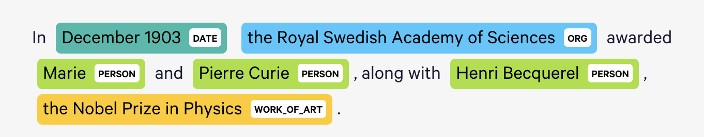
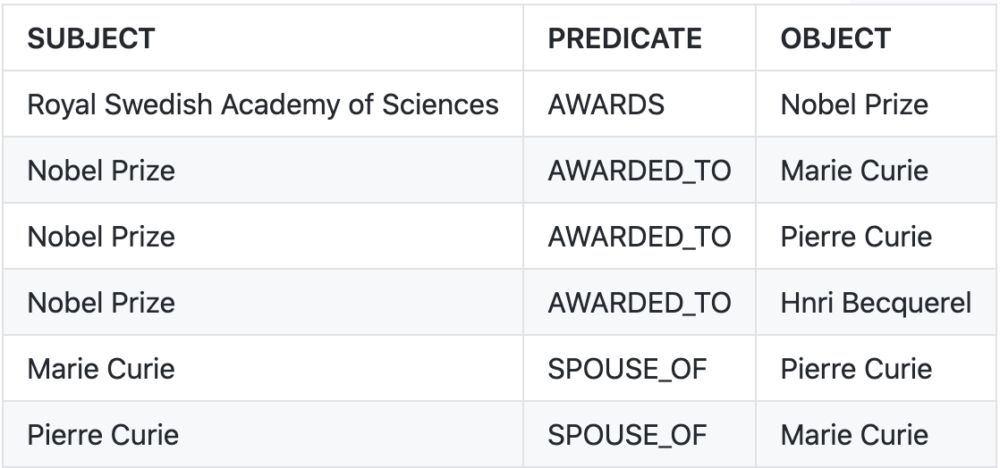
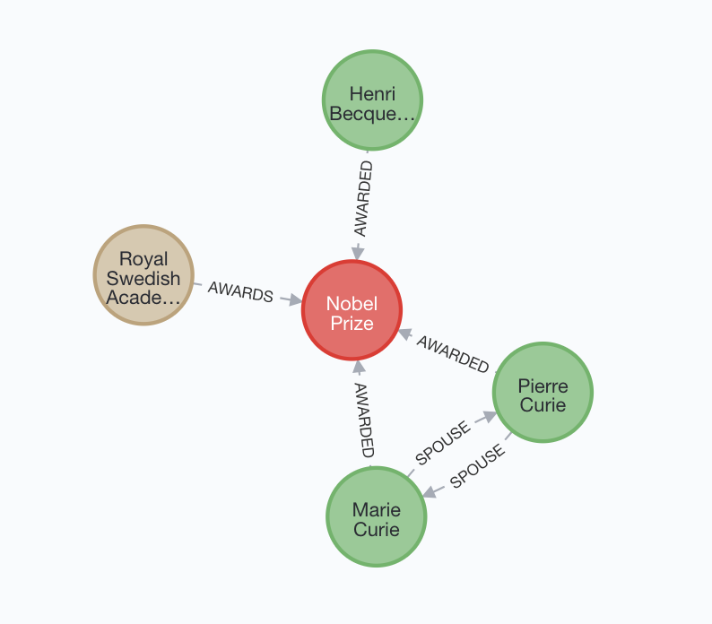

## Introductions

* **Who am I** -- Machine Learning Engineer at Elsevier Labs, with interests in Deep Learning, NLP, Search, Knowledge Graphs, etc.
* **Who you should be (ideally)**
  * have some experience training PyTorch models, 
  * have some familiarity with the HuggingFace Transformers and Datasets APIs,
  * be interested in Named Entity Recognition (NER) and Relation Extraction (RE),
  * be curious about what one can do in this area with HuggingFace Transformers.
* **What you will learn** -- how to implement and fine-tune NER and RE components using HuggingFace transformers.

---

## Agenda

* **Introductions** -- first 15 mins (we are here)
  * Introduce the different components
* **Hands on Transformer based NER** -- 1 hour
  * Intuition behind Transformer based NER
  * Walk-through of code
* **Hands on Transformer based RE** -- 1 hour
  * Intuition behind Transformer based RE
  * Walk-through of code
* **Wrap-up** -- last 15 mins
  * References -- where you can find out more

---

## The Actors

* Named Entity Recognition (NER)
* Relation Extraction (RE)
* Transformers
* Transfer Learning

---

## Named Entity Recognition

* **Named Entity Recognition (NER)** (also known as **(named) entity identification**, **entity chunking** and **entity extraction**) is a subtask of information extraction that seeks to locate and classify named entities mentioned in unstructured text into pre-defined categories such as person names, organizations, locations, medical codes, time expressions, quantities, monetary values, percentages, etc. (_Wikipedia_).

* Converts unstructured text to structured list of Named Entities.
  * 
  * 
| Matched Text                          | Start Offset | End Offset | Entity Type |
| ------------------------------------- | ------------ | ---------- | ----------- |
| December 1903                         |            3 |         16 | DATE        |
| the Royal Swedish Academy of Sciences |           18 |         55 | ORG         |
| Marie                                 |           64 |         69 | PER         |
| Pierre Curie                          |           74 |         86 | PER         |
| Henri Becquerel                       |           99 |        114 | PER         |
| the Nobel Prize in Physics            |          115 |        141 | WORK_OF_ART |

* **Applications**
  * Information Retrieval (things not strings)
  * Clustering / Categorization / Classification
  * Summarization (derive salient topics from named entities)
  * Foundation for downstream tasks such as Relation Extraction

_Image Credit: [DisplaCy Named Entity Visualizer](https://explosion.ai/demos/displacy-ent)_

---

## Relation Extraction

* **Relation Extraction** requires the detection and classification of semantic relationship mentions within a set of named entities. Relationship extraction involves the identification of relations between entities and it usually focuses on the extraction of binary relations. (_Wikipedia, slightly paraphrased_).
* Discovers Relations that connect Named Entities, converting unstructured text to a Graph.
<table cellspacing="0" cellpadding="0" border="0">
  <tr>
    <td></td>
    <td></td>
  </tr>
</table>

* **Applications**
  * Knowledge Base Construction
  * Question Answering
  * Text Analysis in different domains (legal, biomedical)

_Image Credit: Built using Neo4J Console and Cypher_

---

## Transformers

* Proposed in 2017 by Vaswani, et al. ([Attention is all you need](https://arxiv.org/abs/1706.03762))
* Basic component behind the NER and RE architectures we will talk about today
* Transformer based models have achieved SOTA results on many NLP tasks
  * Improves on ConvNets -- receptive field of **Self-Attention** is the full input.
  * Inproves on RNNs -- handles sequential input in parallel using positional embeddings.
* Both Transformer based NER and RE models use only the **Encoder** portion of the Transformer architecture.

_The Transformer Architecture (Image Source: [Dive Into Deep Learning](https://d2l.ai/index.html))_

---

## Transfer Learning

* Process of transferring knowledge from one model to another.
* **Foundation Models** -- large transformer models (many parameters) pre-trained on large volumes of data.
* Training pre-trained foundation models on new tasks usually results in better performance than training from scratch.
  * **Feature Extractor** -- encode data using pre-trained model and use encoding to train a simpler model with less training data.
  * **Fine Tuning** -- replace / add task specific layer and continue training the whole model; parameter values of trained model are used as initial starting point for task specific training.
* HuggingFace 🤗 provides one-stop shop for using Transformers:
  * [Pre-trained models](https://huggingface.co/models)
  * [Major NLP Datasets](https://huggingface.co/datasets)
  * [APIs to train/fine-tune transformers and handle datasets](https://huggingface.co/docs) -- includes Tokenizers, Transformers and Transformer based networks for specific applications.

---

