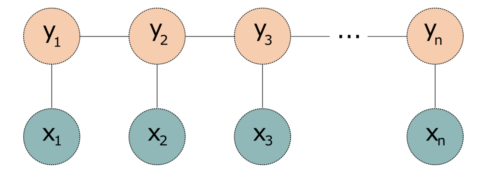
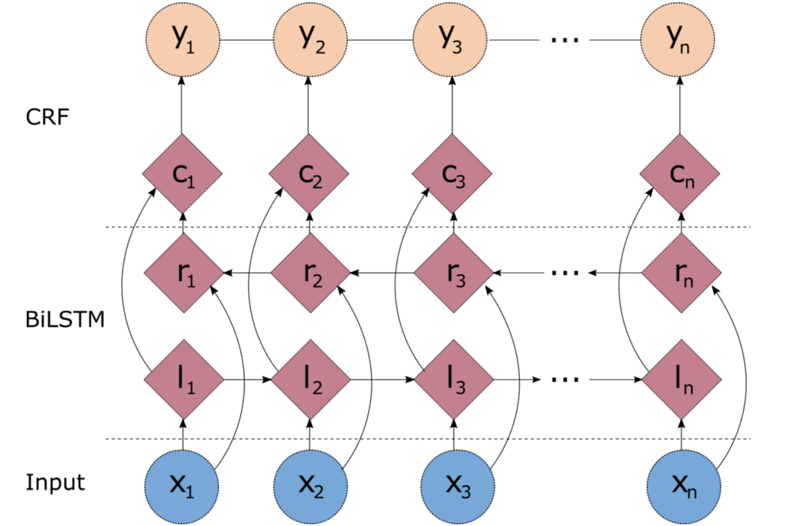
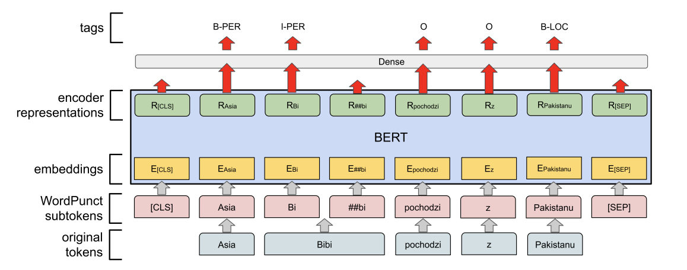

## Techniques for Named Entity Recognition

* **Dictionary Based**
* **Regex based**
* **Model based**
  * **Sequence to Sequence** model -- sequence of tokens go in, sequence of IOB tags come out.
    * 
| **tokens** | Joe       | Biden     | is | the | president | of | the | United     | States     | . |
| ---------- | --------- | --------- | -- | --- | --------- | -- | --- | ---------- | ---------- | - |
| **tags**   | **B-PER** | **I-PER** | O  | O   | O         | O  | O   | **B-GPE**  | **B-GPE**  | O |
  
  * Popular NER models
    * **Hidden Markov Model**
    * **Linear CRF (Conditional Random Field)**
    * **BiLSTM-CRF**
    * **Transformers**

---

## Hidden Markov Model

* Markov assumption: Event at time _t_ can be predicted from events at times (_t-1, ..., t-N_) where _N_ is small.
* Uses engineered word level features.
* Features from recent past used to predict tag at position _t_.
* Most probable tag sequence assigned to token sequence using Viterbi algorithm.

---

## Linear Chain CRF

* Graphical model that calculates the conditional probability of a tag sequence _c = (c1, ..., cN)_ given an observed token sequence _o = (o1, ..., oN)_.
* Considers neighboring examples when making prediction.
* Still uses features generated through feature engineering.

_A Linear chain Conditional Random Fields model. Image Source: [Building a Named Entity Recognition model using a BiLSTM-CRF network](https://blog.dominodatalab.com/named-entity-recognition-ner-challenges-and-model))_

---

## BiLSTM-CRF

* Popular neural architecture for NER.
* End-to-end model, features are inferred during training.
* Recurrent Network (LSTM) considers all time steps prior to current time step (LHS context).
* Bidirectional LSTM considers LHS and RHS context together, provides neighborhood context information.
* Output of both LSTMs fed to a linear chain CRF, is effectively an attention mechanism.

_Architecture of a BiLSTM-CRF Model. (Image Source: [Building a Named Entity Recognition model using a BiLSTM-CRF network](https://blog.dominodatalab.com/named-entity-recognition-ner-challenges-and-model))_

---

## Transformer based NER

* Modeled as a token classification task, HuggingFace provides `XXXForTokenClassification` models to do NER.
* Input token sequence is padded with [CLA] and [SEP] tags, and subword tokenized.
* Transformer Encoder (BERT) used to generate embeddings, output sent to shared Linear layer to produce logits across the tag vocabulary.
* Self-attention plus linear layer serves as equivalent of CRF head.

_Architecture of a Transformer based NER Model (Image Source: [Tuning Multilingual Transformers for Named Entity Recognition on Slavic Languages](https://aclanthology.org/W19-3712.pdf))_

