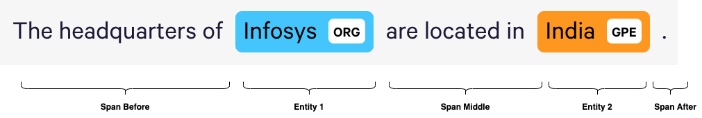
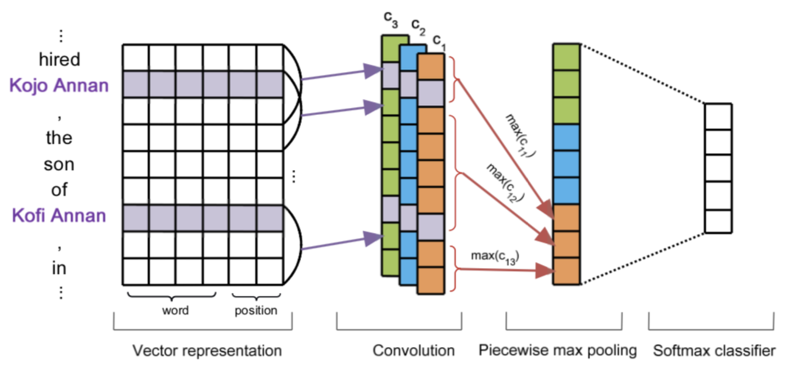
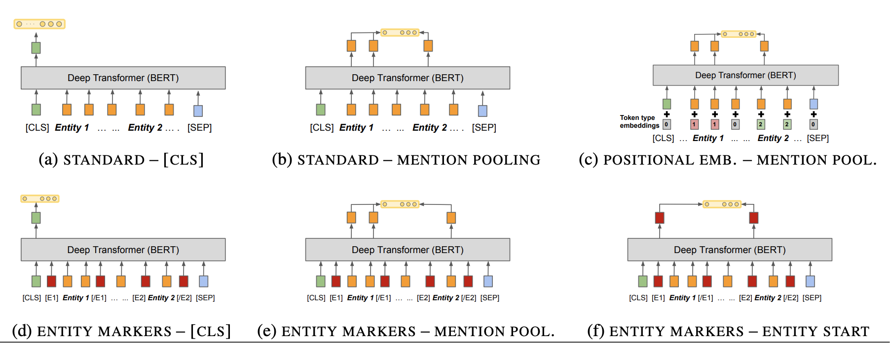

## Techniques for Relation Extraction

* Non-trivial task, usually domain dependent
> General purpose relation extractors, which can model arbitrary relations, are a core aspiration in information extraction. Efforts have been made to build general purpose extractors that represent relations with their surface forms, or which jointly embed surface forms with relations from an existing knowledge graph. _(from [Matching the Blanks: Distributional Similarity for Relation Learning](https://arxiv.org/abs/1906.03158))_
* Most RE focus on extracting binary relations, i.e. of the form: _AWARDED(Marie Curie, Nobel Prize)_
* Relation Extraction is an **N-way Classification Problem**
* **RE Techniques**
  * Unsupervised / Semi-supervised
  * Supervised
    * Feature based Methods -- involves feature engineering and domain specific heuristic choices.
    * Kernel Methods
      * **Bag of Features Kernel**
      * Tree Kernel
      * **Piecewise CNN (PCNN)**
      * **Transformer based RE**

---

## Bag of Features Kernel

* Context around entity mentions (span before, span middle, span after) useful to determine relation type between entities **Infosys** and **India**.
* 3 sub-kernels (composed of string subsequences from each span) created
* SVM RE classifier based on the intuition that another sentence with similar sub-kernels is likely to indicates a similar relation.
* Tree kernels compute similarity between two entity-augmented shallow parse tree structures.

---

## Piecewise CNN (PCNN)

* Popular general purpose neural architecture for Relation Extraction.
* Each sentence can naturally be divided into 3 spans based on the positions of entities in focus.
  * span-before + entity-1, 
  * span-middle + entity-2, 
  * span-after
* MAXPOOL from each segment computed separately and concatenated
* Finally passed to a N-way Linear (Dense) layer for classifying the relation type.

_Architecture of the PCNN Model (Image Source: [Distant Supervision for Relation Extraction via Piecewise Convolutional Neural Networks](https://aclanthology.org/D15-1203/))_

---

## Transformer based RE

* HuggingFace 🤗 does not provide a `XXXForRelationExtraction` model out of the box.
* We create one with `XXXForPreTraining` body and a (`Dropout`+`LayerNorm`+`Linear`) classifier head.
* Our implementation is model (e) below.
  * We introduce new marker tokens pairs for subject and object mention for for each ENTITY_TYPE.
  * Enclose each of our entity mentions (subject and object) within these entity marker tokens.
  * MAXPOOL the tokens between the subject and object entity marker tags and concatenate.
  * Input concatenated vector into custom classifier head and learn to predict one of N relation classes. 

_Architecture Variations for Transformer based Relation Extractors (Image Source: [Matching the Blanks: Distributional Similarity for Relation Learning](https://arxiv.org/abs/1906.03158))_

___

