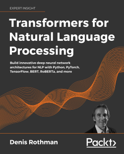
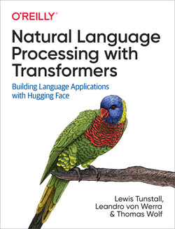

## Third Party NER/RE Tools

* Named Entity Recognition (NER)
  * [SpaCy](https://spacy.io/) -- command line interface to train NER using configuration files.
  * [Flair](https://github.com/flairNLP/flair) -- programmatic interface neural and Transformer based NER.
  * [SimpleTransformers](https://simpletransformers.ai/) -- simplified interface to Transformer models in general, including NER.
  * [NERDS](https://github.com/elsevierlabs-os/nerds) -- unified programmatic interface to various third party NER libraries.
* Relationship Extraction (RE)
  * [SpaCy](https://spacy.io/) -- RE component is available but not provided OOB.
  * [Flair](https://github.com/flairNLP/flair) -- programmatic interface to neural RE model.
  * [OpenNRE](https://github.com/thunlp/OpenNRE) -- programmatic interface to neural (PCNN) and Transformer based RE models.

## References

* **Papers**
  * [Recent Named Entity Recognition and Classification Techniques: A systematic review](https://www.sciencedirect.com/science/article/pii/S1574013717302782) -- Archana Goyal, Vishal Gupta, and Manish Kumar, 2018.
  * [A Survey on Recent Advances in Named Entity Recognition from Deep Learning models](https://arxiv.org/abs/1910.11470) -- Vikas Yadav and Steven Bethard, 2019.
  * [A frustratingly easy approach for entity and relation extraction](https://arxiv.org/abs/2010.12812) -- Zexuan Zhong and Danqi Chen, 2021
  * [A Review of Relation Extraction](https://www.cs.cmu.edu/~nbach/papers/A-survey-on-Relation-Extraction.pdf) -- Nguyen Bach and Sameer Badaskar, 2007.
  * [A Survey of Deep Learning Methods for Relation Extraction](https://arxiv.org/abs/1705.03645) -- Shantanu Kumar, 2017.
  * [Maching the Blanks: Distributional Similarity for Relation Learning](https://arxiv.org/abs/1906.03158) -- Livio Baldini Soares, Nicholas Fitzgerald, Jeffrey Ling and Tom Kwiatkowski, 2019.
* **Books**
  * [Transformers for Natural Language Processing](https://www.packtpub.com/product/transformers-for-natural-language-processing/9781800565791)
  * [Natural Language Processing with Transformers](https://www.oreilly.com/library/view/natural-language-processing/9781098103231/)

<table cellspacing="3" cellpadding="0" border="0">
  <tr>
    <td></td>
    <td></td>
  </tr>
</table>

